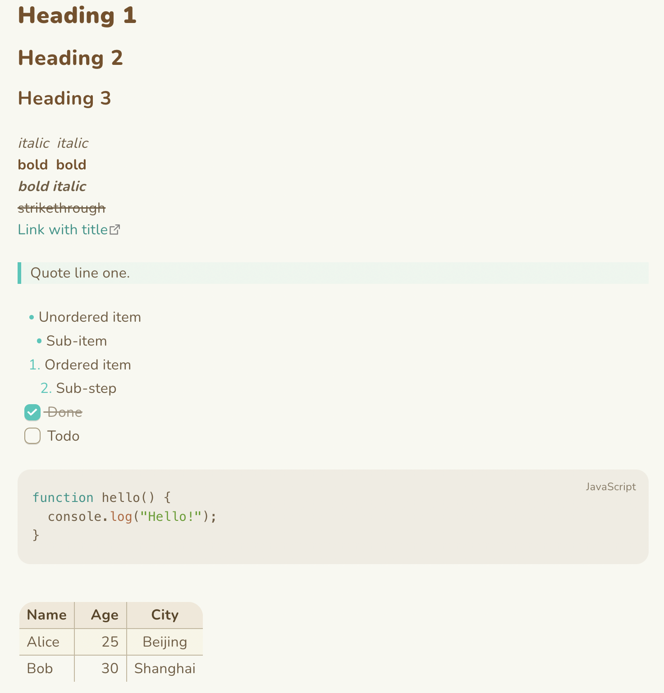
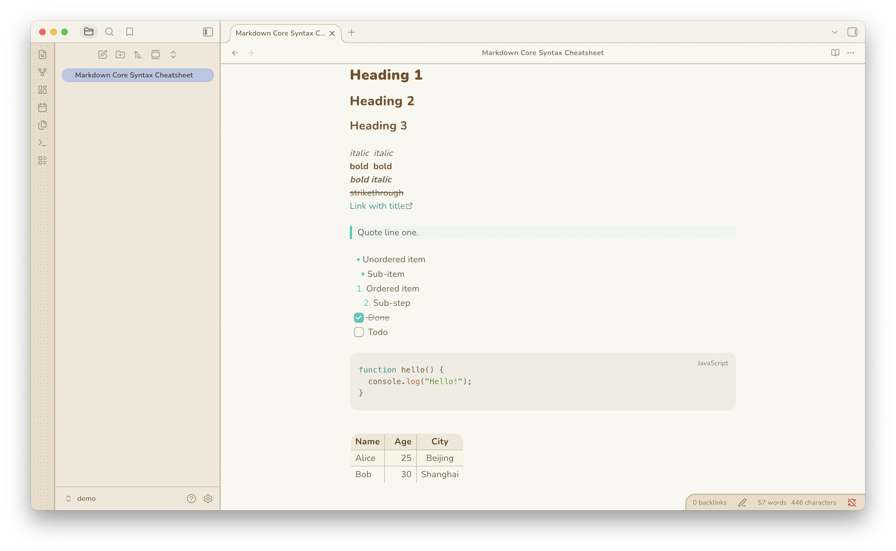
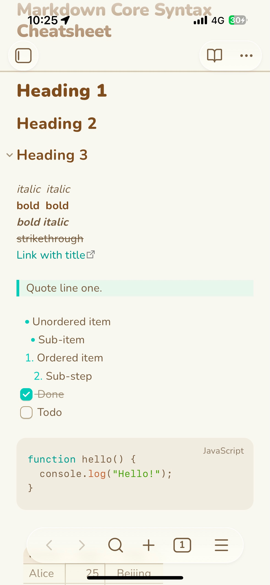

# Animal Island —— Obsidian 主题

动物森林风格的 [Obsidian](https://obsidian.md) 主题。
温暖的羊皮纸底色、泥土棕文字、薄荷青点缀，圆滚滚的胶囊控件和厚实的“游戏按钮”主操作。

## 安装

1. 打开 Obsidian → 设置 → 外观 → 主题，选择 **Animal Island**。
2. 明暗两种模式都支持：
   - 亮色 = **Island Day**（羊皮纸 + 薄荷绿，原始配色）
   - 暗色 = **Island Night**（暖调深棕羊皮纸，沿用同一套色板）

## 许可

本主题代码以 [The Unlicense](LICENSE) 发布，已捐献给公共领域。你可以出于任何目的（商用或非商用）自由使用、修改和再分发，无需署名。
